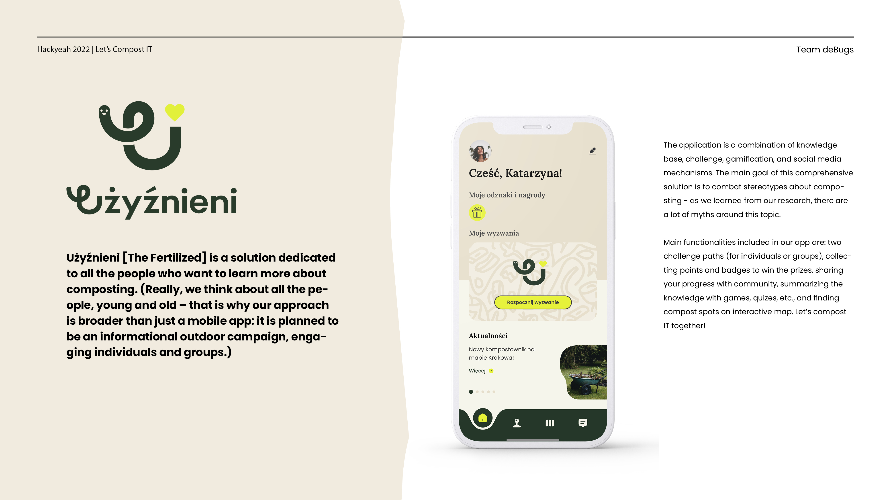

## Main functionalities: 

- For activities and challenges, the user receives badges and points that can be exchanged for rewards. 

- The rewards are intended to reinforce environmental habits.

The challenge stages conclude with a mini-game or quiz - through gamification mechanisms, we want to teach users through play.

- The "Discover" tab is a knowledge base on composting: the most common questions are answered there, with instructions and recordings of people who have been composting for a long time. Here, the user can expand the knowledge he or she has gained during the challenge.

- In the "Community" tab, we use social media mechanisms - we encourage you to share your progress, continue your composting adventure and invite your friends to join in.

- The map includes points where you can give away compost or bio-waste you have produced and cannot use yourself.

## What do we aim?

- Based on the research, we selected our priorities. The app is intended to:

- Educate about proper composting
teach through play.

- Take into account the administrative aspect.

- Be inclusive: involving not only in form but also in language
combat harmful stereotypes about composting.

- Offer real benefits of the challenge
communicate the benefits of composting, also on a wider scale (e.g. biofuels).

